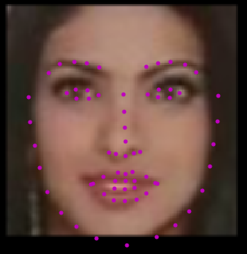
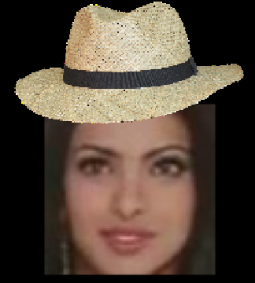
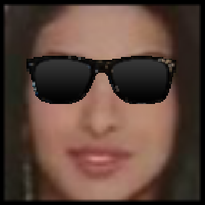
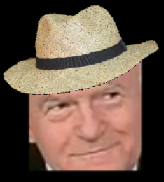

[//]: # (Image References)

[image1]: ./images/key_pts_example.png "Facial Keypoint Detection"

# Facial Keypoint Detection

## Project Overview

Build a facial keypoint detection system that takes in any image with faces, and predicts the location of 68 distinguishing keypoints on each face.

Facial keypoints include points around the eyes, nose, and mouth on a face and are used in many applications. These applications include: facial tracking, facial pose recognition, facial filters, and emotion recognition. The completed code looks at any image, detect faces, and predict the locations of facial keypoints on each face. Also, a basic facial filter module has also been implemented.

Dataset: [YouTube Faces Dataset](https://www.cs.tau.ac.il/~wolf/ytfaces/)

![Facial Keypoint Detection][image1]

The project is broken up into a few main parts in four Python notebooks:

__Notebook 1__ : Loading and Visualizing the Facial Keypoint Data

__Notebook 2__ : Defining and Training a Convolutional Neural Network (CNN) to Predict Facial Keypoints

__Notebook 3__ : Facial Keypoint Detection Using Haar Cascades and your Trained CNN

__Notebook 4__ : Fun Filters and Keypoint Uses


## Setup

1. Clone the repository, and navigate to the downloaded folder.
```
git clone https://github.com/kmjawadurrahman/facial-keypoints-detection.git
cd facial-keypoints-detection
```

2. Create (and activate) a new environment, named `cv-nd` with Python 3.6. If prompted to proceed with the install `(Proceed [y]/n)` type y.

	- __Linux__ or __Mac__:
	```
	conda create -n cv-nd python=3.6
	source activate cv-nd
	```
	- __Windows__:
	```
	conda create --name cv-nd python=3.6
	activate cv-nd
	```

	At this point your command line should look something like: `(cv-nd) <User>:facial-keypoints-detection <user>$`. The `(cv-nd)` indicates that your environment has been activated, and you can proceed with further package installations.

3. Install PyTorch and torchvision; this should install the latest version of PyTorch.

	- __Linux__ or __Mac__:
	```
	conda install pytorch torchvision -c pytorch
	```
	- __Windows__:
	```
	conda install pytorch-cpu -c pytorch
	pip install torchvision
	```

6. Install a few required pip packages, which are specified in the requirements text file (including OpenCV).
```
pip install -r requirements.txt
```


## Data

All of the data we need to train the neural network is in the subdirectory `data`. In this folder are training and tests set of image/keypoint data, and their respective csv files. This is further explored in Notebook 1: Loading and Visualizing Data.

## Experiments:  <br>

Tested using RTX 2060 GPU

| Sl No. | Model Architecture | Forward Function | Batch Size | Loss | Optimizer | Epochs | Training Loss (Avg. of final batch) | Training Time | Curve Summary |
| ------------- | ------------- | ------------- | ------------- | ------------- | ------------- | ------------- | ------------- | ------------- | ------------- |
| 1 | \*conf1 | \*forward | 10 | MSELoss | Adam (with default params) | 1 | 0.1812 | 21.4 | Sharp loss decrease till batch 30, then slow decrease until end of epoch 1 batch 340. Curve is a little noisy. |
| 2 | \*conf1 | \*forward | 20 | MSELoss | Adam (with default params) | 1 | 0.2386 | 20.2 | Sharp loss decrease till batch 30, then slow decrease until end of epoch 1 batch 170. Curve less noisy. |
| 3 | \*conf1 | \*forward | 50 | MSELoss | Adam (with default params) | 1 | 0.1832 | 18.2 | Sharp loss decrease till batch 30, then slow decrease until end of epoch 1 batch 70. Curve is a lot less noisy. |
| 4 | \*conf1 | \*forward | 50 | MSELoss | Adam (with default params) | 10 | 0.1157 | 189.4 | Sharp loss decrease till epoch 1 batch 30, then slow, gradual decrease until end of epoch 10 batch 70. Curve is a lot less noisy. |
| 5 | \*conf1 | \*forward | 50 | L1Loss | Adam (with default params) | 1 | 0.3383 | 18.0 | Sharp loss decrease till batch 30, then slow decrease until end of epoch 1 batch 70. Curve is a lot less noisy. |
| 6 | \*conf1 | \*forward | 50 | L1Loss | Adam (with default params) | 10 | 0.2487 | 176.8 | Sharp loss decrease till epoch 1 batch 30, then slow, gradual decrease until end of epoch 10 batch 70. Curve is a lot less noisy. |
| 7 | \*conf1 | \*forward | 50 | SmoothL1Loss | Adam (with default params) | 1 | 0.1004 | 21.6 | Sharp loss decrease till batch 30, then slow decrease until end of epoch 1 batch 70. Curve is a lot less noisy. |
| 8 | \*conf1 | \*forward | 50 | SmoothL1Loss | Adam (with default params) | 10 | 0.0480 | 174.5 | Sharp loss decrease till batch 30, then slow decrease until end of epoch 10 batch 70. Curve is a lot less noisy. Test output visualizations seems better than MSELoss and L1Loss outputs given all else same. |
| 9 | \*conf1 | \*forward | 10 | MSELoss | SGD lr=0.001 | 1 | 0.6545 | 20.4 | No apparent decrease in loss over the first epoch with SGD's lr=0.001. Curve is fluctuates a lot. |
| 10 | \*conf1 | \*forward | 10 | MSELoss | SGD lr=0.01 | 1 | 0.5305 | 20.1 | A little decrease in loss over the first epoch with SGD's lr=0.01. Curve is fluctuating a lot. |
| 11 | \*conf1 | \*forward | 50 | MSELoss | SGD lr=0.01 | 1 | 0.6179 | 18.3 | No apparent decrease in loss over the first epoch with SGD's lr=0.01 and batch size of 50. Curve is fluctuating a lot. |
| 12 | \*conf1 | \*forward | 50 | MSELoss | SGD lr=0.01 | 10 | 0.2122 | 174.3 | Loss decrease slowly till end of epoch 4, then there is much sharper decline at the start of epoch 5, followed by slow decrease again. SGD even with lr=0.01 is taking a much longer time to converge compared to Adam. |
| 13 | \*conf1 | \*forward | 50 | SmoothL1Loss | Adam (with default params) | 50 | 0.2545 (less than 0.2 for last 10 average) | 915.4 | Sharp loss decrease till batch 30, then relatively slow decrease until end of epoch 10 batch 70. Then very slow and gradual decline till epoch 50 batch 70. Curve is a lot less noisy. Test output visualizations seems quite good. |
| 14 | **\*conf2** | \*forward | 50 | SmoothL1Loss | Adam (with default params) | 50 | 0.0119 | 1024.4 | Same as above, but this architecture with gradual decrease of neurons in dense layers gives even better output visualizations on test data. Also, the loss is lower given all else kept the same. It takes slightly longer to train compared to the other architecture. |
| 15 | **\*conf2** | \*forward | 50 | SmoothL1Loss | Adam (with default params) | 500 | 0.0081 | 10691.3 | Not much change in error curve after about 100 epochs. Excellent output visualizations on test data. |

 <br>

**Note:** Different loss functions will give loss values at different ranges, e.g. MSELoss is calculated differently than L1Loss, so comparisons should not be made among different loss functions based on the Loss column above. Fair comparisons can only be made between rows having the same Loss function.

**\*conf1:**

Net( <br>
  (conv1): Conv2d(1, 32, kernel_size=(5, 5), stride=(1, 1)) <br>
  (maxpool): MaxPool2d(kernel_size=2, stride=2, padding=0, dilation=1, ceil_mode=False) <br>
  (conv2): Conv2d(32, 64, kernel_size=(3, 3), stride=(1, 1)) <br>
  (conv3): Conv2d(64, 128, kernel_size=(3, 3), stride=(1, 1)) <br>
  (conv4): Conv2d(128, 256, kernel_size=(3, 3), stride=(1, 1)) <br>
  (conv5): Conv2d(256, 512, kernel_size=(3, 3), stride=(1, 1)) <br>
  (fc1): Linear(in_features=12800, out_features=1000, bias=True) <br>
  (fc2): Linear(in_features=1000, out_features=1000, bias=True) <br>
  (output): Linear(in_features=1000, out_features=136, bias=True) <br>
  (dropout1_2): Dropout(p=0.1, inplace=False) <br>
  (dropout3_4_5): Dropout(p=0.3, inplace=False) <br>
  (dropout6_7): Dropout(p=0.5, inplace=False) <br>
) <br>

**\*conf2:**

Net( <br>
  (conv1): Conv2d(1, 32, kernel_size=(5, 5), stride=(1, 1)) <br>
  (maxpool): MaxPool2d(kernel_size=2, stride=2, padding=0, dilation=1, ceil_mode=False) <br>
  (conv2): Conv2d(32, 64, kernel_size=(3, 3), stride=(1, 1)) <br>
  (conv3): Conv2d(64, 128, kernel_size=(3, 3), stride=(1, 1)) <br>
  (conv4): Conv2d(128, 256, kernel_size=(3, 3), stride=(1, 1)) <br>
  (conv5): Conv2d(256, 512, kernel_size=(3, 3), stride=(1, 1)) <br>
  (fc1): Linear(in_features=12800, **out_features=6400**, bias=True) <br>
  (fc2): Linear(**in_features=6400**, out_features=1000, bias=True) <br>
  (output): Linear(in_features=1000, out_features=136, bias=True) <br>
  (dropout1_2): Dropout(p=0.1, inplace=False) <br>
  (dropout3_4_5): Dropout(p=0.3, inplace=False) <br>
  (dropout6_7): Dropout(p=0.5, inplace=False) <br>
) <br>

**\*forward:**

x = self.maxpool(F.relu(self.conv1(x))) <br>
        x = self.dropout1_2(x) <br>
        x = self.maxpool(F.relu(self.conv2(x))) <br>
        x = self.dropout1_2(x) <br>
        x = self.maxpool(F.relu(self.conv3(x))) <br>
        x = self.dropout3_4_5(x) <br>
        x = self.maxpool(F.relu(self.conv4(x))) <br>
        x = self.dropout3_4_5(x) <br>
        x = self.maxpool(F.relu(self.conv5(x))) <br>
        x = self.dropout3_4_5(x) <br>
        x = x.view(x.size(0), -1) <br>
        x = F.relu(self.fc1(x)) <br>
        x = self.dropout6_7(x) <br>
        x = F.relu(self.fc2(x)) <br>
        x = self.dropout6_7(x) <br>
        x = self.output(x) <br>

#### Optimization and loss functions:

I ran experiments using Stochastic Gradient Descent (SGD) and Adam optimization functions. Single epoch using SGD(lr=0.001) showed little or no noticeable change in loss over time. Then, increasing SGD's lr to 0.01 gave a little decrease in loss over the first epoch. When ran over 50 epochs, SGD was slowly able to lower the loss over time. However, replacing SGD with Adam optimizer (with default params) and keeping all else same, I found that the loss decreased much faster. Also, the training time for Adam was only slightly higher compared to SGD. Therefore, I used Adam optimizer since it takes less time to converge.

I compared 3 loss functions which are all suitable for regression problems that produce continuous, numeric outputs, namely MSELoss, L1Loss and SmoothL1Loss. Since L1Loss and MSELoss use different formulas to calculate the loss (and SmoothL1Loss being a combination of the two), meaningful comparisons cannot be made by only looking at the loss numbers. So, instead I ran experiments using Adam optimizer, a batch size of 50 and for a total of 10 epochs for each of the 3 loss functions, and then looked at the output visualizations on test data. SmoothL1Loss gave the best outputs on test data (at least visually for a few batches) and it also took slightly less time to train compared to L1Loss and MSELoss.


#### Network architecture:

I brought the image down to reasonable size using combinations of Conv2d and MaxPool2d filter layers before using a series of Dense layers. It required 5 Conv2d+MaxPool2d layers to bring the image dimension down to 5-by-5. Doubling the number of filters at each such layer gave 32 * 2^4 = 512 filters before the first Dense layer. So, the first Dense layer consisted of 512*5*5 = 12800 nodes. I also used Dropoff between each layer in order to reduce overfitting (increasing the dropoff probability gradually in later layers). I only tested two architectures by only varying in_features of the second-last Dense layer. At first, I used 1000 nodes for the second-last Dense layer. However, I wanted to test how the loss trend and the output results differ if I increase in_features of the second-last layer from 1000 to 6400. Comparing these experiments by keeping everything else constant, I found that the variant with in_features=6400 in the second-last Dense layer resulted in a much lower training loss, and it only took slightly longer to train. Hence, I chose this architecture.


#### Number of epochs and batch_size:

For the batch size, I ran experiments using batch sizes of 10, 20 and 50. The loss fluctuates less over time for larger batch sizes, and the training time also decreased slightly. Otherwise, I could not identify any other significant differences for the limited number of experiments that I could run. I decided to go with batch size of 50 because a larger batch size gave much smoother loss trends over time, which made the loss curve a little easier to interpret, especially for initial experiments where I used lower number of epochs. Also, the computer faced no difficulties in performing the training steps when using batch size of 50.

I initially ran quick experiments for combinations of different architectures, batch sizes, optimizer and loss functions using a single epoch. I used 50 epochs to select the final architecture. For my setup, the loss does not decrease much after about 100 epochs.

## Output and facial filters

Using the trained facial keypoint detector, we can now do things like add filters to a person's face, automatically.

#### Sample output



#### Apply filters






##### Filter on tilted head:



## License

This project is licensed under the terms of the MIT license.
